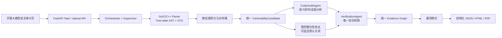
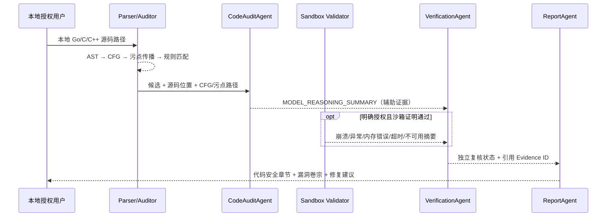

# 大模型服务软件代码安全审计架构

> 仅用于安全审计与防御研究，仅限教学实验使用。

## 目标与边界

本模块在既有“提示词注入、系统提示词泄露、安全对齐绕过”AI 交互审计之外，增加 `software_code` 审计域。检测对象只能是本地部署、明确授权的开源大模型服务源码或本地服务实例。所有发现先以 `CANDIDATE` 进入证据链；只有独立 `VerificationAgent` 可以写入确认、排除或存疑状态。

禁止远程扫描、执行代码验证、权限提升、敏感数据读取、数据外传以及生成 PoC、利用代码、攻击载荷或绕过步骤。

## 模块图

静态引擎实现位于 `src/vulnagent/analyzers/source/`，代码研判 Agent 位于 `src/vulnagent/agents/code_audit_agent.py`，动态框架位于 `src/vulnagent/dynamic_validation/`。报告模块只读取公共 Task、Finding、Evidence 与 Verification 数据，不反向依赖分析器。

## 数据流图

## 核心数据结构

- `SourceAnalysisResult.metadata.native_analysis`：按文件保存规范化 AST、函数、CFG 节点/边及数据流事实。
- `VulnerabilityCandidate.metadata`：`audit_domain`、`rule_id`、`sink`、`snippet`、`cfg_path`、`taint_path`、`guard_observed`。
- `Evidence`：源码定位、代码片段、CFG、污点路径、规则结果、动态摘要、智能体摘要、独立复核结果。
- `software_code_security.dossiers[]`：源码位置、控制流、污点路径、静态证据、动态结果、研判、复核与修复建议。
- 卷宗约束：`configs/vulnerability_dossier.schema.json`。

## 接口清单

| 接口 | 输入 | 输出 | 安全属性 |
|---|---|---|---|
| `SourceProjectParser.analyze` | `ProjectInput` | `SourceAnalysisResult` | 只读解析，不编译、不执行 |
| `MultiLanguageSourceAuditor.audit` | `SourceAnalysisResult` | 候选列表 | 只生成 `CANDIDATE` |
| `CodeAuditAgent.run` | Task + Context | 辅助 Evidence | 无结论权限，输出经过白名单化 |
| `BoundaryCaseGenerator.generate` | 基准请求 + 字段约束 | 内存中测试用例 | 数量/长度有硬上限 |
| `ControlledRobustnessEngine.run` | 回环端点 + Sandbox Adapter | `RobustnessRun` | 沙箱证明不满足即拒绝 |
| `robustness_evidence` | 运行摘要 | `RUNTIME_TRACE` | 不保存原始输入和响应正文 |
| `StructuredReportGenerator.generate` | `ReportRequest` | `ReportResult` | 只消费公共协议 |

## 三层判定关系

1. 静态层定位“可能有问题的位置”，提供可复现的结构化事实。
2. 动态层仅观察健壮性异常，不尝试代码执行、提权或敏感数据访问；没有合格沙箱适配器时保持关闭。
3. 智能体层结合上下文分析误报与抽象可达性，但其输出只能作为辅助证据。独立复核层综合全部 Evidence 后给出正式状态。

## 规则覆盖

规则库格式见 `configs/source_audit_rules.schema.json`，默认库见 `configs/source_audit_rules.yaml`。当前可执行的核心规则覆盖无边界字符串/内存拷贝、受控长度 `memcpy`、分配大小整数算术、数组下标、输入校验、空指针、函数内资源生命周期、本地管理接口访问控制和配置修改授权。它们都是保守的候选检测；宏、别名、跨函数数据流和动态分派仍可能不完整，报告不会把候选误写成已确认漏洞。

## 安全边界

- 网络：动态端点仅允许 `localhost`、`127.0.0.0/8` 或 `::1`，禁用环境代理和重定向。
- 权限：沙箱必须证明低权限、无外网、只读根文件系统、可销毁；否则 fail closed。
- 资源：CPU、内存、进程、用例数、文本长度、超时和响应读取量均有上限。
- 数据：证据仅记录用例类型、字段路径、长度摘要、状态码和进程状态；不保留原始输入、响应正文和敏感数据。
- 生命周期：无论测试成功或异常，都在 `finally` 中调用环境重置。
