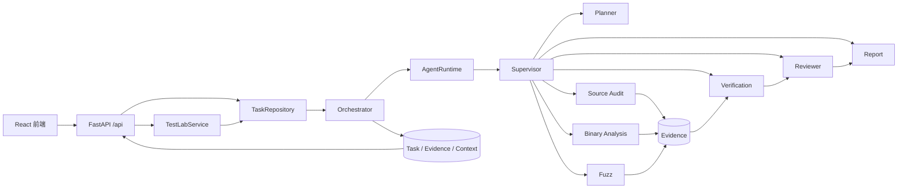

# VulnAgent V0.4 后端逻辑与功能说明（新生版）

> 合规声明：本项目用于北京邮电大学网络空间安全专业本科课程答辩与学术展示。所有动态测试只允许在本地、明确授权、可控的教学环境中执行，不面向公网或未授权目标。

## 1. 先用一句话理解 VulnAgent

VulnAgent 是一个“先收集证据，再判断漏洞”的多智能体协作系统：不同智能体分别负责规划、源码/二进制分析、受控模糊测试、独立验证、结果复核和报告生成，任何单个分析模块都不能直接把自己的猜测宣布为已确认漏洞。

可以把它想成一次小型代码安全会诊：

- 分析智能体像“初诊医生”，负责提出候选问题；
- Evidence（证据）像检查报告，记录问题出现在哪里、怎么发现；
- Verification（独立验证）像复诊医生，决定候选是确认、排除还是证据不足；
- Reviewer（复核）检查材料有没有缺页或相互矛盾；
- Report（报告）只整理已有事实，不临时编造结论。

## 2. 后端总体结构



最重要的设计原则有四条：

1. 前端只负责展示和提交参数，真正的状态与分析逻辑都在 Python 后端；
2. `Orchestrator` 是唯一正式任务生命周期入口；
3. `Supervisor` 决定下一步由哪个智能体工作，LLM 只能给规划建议，不能控制路由；
4. 只有 `Verification` 能把候选状态改成 `CONFIRMED`、`REJECTED` 或 `UNCERTAIN`。

## 3. 一次任务是怎么跑起来的

以大屏中的“加壳闭源软件测试”为例：

### 第 1 步：前端提交测试参数

前端向 `POST /api/test-lab/runs` 提交目标名称、本机文件路径、预期 SHA-256、保护类型、授权勾选、是否启用动态验证和种子输入。

接口先返回 `202 Accepted` 和一个 `run_id`，随后通过后台任务执行分析。前端不断请求 `GET /api/test-lab/runs/{run_id}`，因此页面可以边运行边显示日志。

### 第 2 步：TestLab 做安全准入

`TestLabService` 会逐目标检查：

- 是否明确勾选了测试授权；
- 路径是否为本机文件，而不是 URL 或 UNC 网络路径；
- 文件头是否为 PE 或 ELF；
- 实际 SHA-256 是否和填写值一致；
- 如果启用动态验证，是否已经同时确认授权。

检查通过后，TestLab 把页面参数转换成统一的 `Target`，再交给正式 `TaskManager` 和 `Orchestrator`，不会另起一套“只为演示而存在”的假流程。

### 第 3 步：Planner 生成有界计划

`PlannerAgent` 根据目标类型选择源码或二进制路线，并列出本次允许调用的能力。例如二进制任务通常包含：

```text
binary.inspect
binary.logic
binary.obfuscation
verification.verify
report.generate
```

只有目标元数据中的 `fuzz_authorized=true` 与 `dynamic_validation=true` 同时成立时，计划才会加入 `fuzz.execute`。

LLM 可以返回一个简短 JSON 规划建议，但 `routing_authority` 固定属于确定性的 Supervisor。即使模型返回异常内容，后端也会降级使用规则计划。

### 第 4 步：Supervisor 选择下一个智能体

典型二进制动态流程是：

```text
Planner
  → Binary Analysis
  → Fuzz（仅在有候选且已授权时）
  → Verification
  → Reviewer
  → Report
  → Finish
```

如果静态分析没有产生任何候选，Supervisor 会直接进入 Report；这就是“勾选了动态验证，但仍未执行”的一个常见原因。运行时还设置了最大智能体步数、同一路由最大重复次数和有限重试次数，避免智能体无限循环。

## 4. 各智能体分别做什么

| 智能体 | 主要输入 | 主要工作 | 主要输出 |
| --- | --- | --- | --- |
| Planner | Task、目标元数据 | 选择分析路线和能力 | PLAN 消息 |
| Source Audit | 源码路径 | 项目解析、AST/调用关系分析、缺陷规则检测 | 候选漏洞、源码位置、代码片段、污点路径 |
| Binary Analysis | PE/ELF 路径 | 静态结构解析、可选 UPX 副本解包、反编译/CFG、逻辑与混淆信号分析 | 二进制候选、地址/反汇编、工具结果 |
| Fuzz | 授权目标、种子、静态风险提示 | 生成固定预算的输入变异，通过标准输入受控执行目标 | 变异输入、运行轨迹、异常退出证据 |
| Verification | 候选和对应证据 | 去重并按确定性规则独立判断 | CONFIRMED / REJECTED / UNCERTAIN |
| Reviewer | 已验证候选 | 检查重复项、证据缺失、状态冲突和字段完整性 | 复核说明，不改漏洞状态 |
| Report | Task、Finding、Evidence、Verification | 汇总严重等级、证据链、修复建议和限制 | 结构化报告 |

这里的“多个智能体”不是多个聊天窗口，而是多个职责单一、通过公开数据结构交换结果的后端组件。这样更方便测试，也能避免一个模型既当分析员又当裁判。

## 5. 源码审计模块

真实配置 `v03-source` 下，源码流程由 `SourceProjectParser` 和 `PythonSourceAuditor` 完成。

### 5.1 导入和解析

解析器遍历项目文件，建立文件清单、Python 语法树、符号、依赖与调用图。遇到单个语法错误时会记录问题并继续处理其他文件，而不是让整个任务崩溃。

### 5.2 缺陷发现

审计器从不可信输入出发，追踪数据是否到达危险函数。例如：

```text
HTTP 参数 / input()
        ↓
变量赋值和简单分支传播
        ↓
os.system / eval / 非参数化 SQL / 不安全反序列化
```

发现模块只生成 `VulnerabilityCandidate`，同时附带：

- `SOURCE_LOCATION`：文件和行号；
- `CODE_SNIPPET`：有界代码片段；
- `TAINT_PATH`：输入到危险点的数据流；
- `TOOL_RESULT`：命中的规则和分析器信息。

当前深度语义审计主要支持 Python。C、C++、Java 和 Go 可以被识别或作为二进制编译目标使用，但不能声称拥有同等完整的源码语义覆盖。

## 6. 二进制静态审计模块

二进制路线首先进行只读分析，不执行上传文件。

### 6.1 基础结构解析

内置分析器读取 PE/ELF 文件头、体系结构、入口点、节区、导入、导出、有界字符串和打包信号。它先核对格式和边界，再解析内容，以减少损坏文件导致的异常。

### 6.2 可选外部工具

对于已授权的“加壳/混淆实验室”目标，后端可调用项目内配置的工具：

- UPX：只对副本做识别与解包，不运行目标；
- radare2：提取函数、伪代码和控制流图；
- `binary.logic`：定位认证、密码学、注册、网络输入、内存操作等线索；
- `binary.obfuscation`：记录高熵节、壳标记、字符串编码等混淆信号。

逻辑定位和混淆分数只是“线索”，不是漏洞结论。真正的二进制候选通常还要能找到危险 API 符号、伪代码调用或更具体的调用点语义。

### 6.3 为什么加壳不等于有漏洞

加壳的目标是压缩或隐藏程序结构；混淆的目标是增加理解难度。二者都不能直接证明程序存在漏洞。因此报告会分别表达：

```text
保护/混淆信号：这个程序看起来经过了保护
漏洞候选：这里可能存在危险调用
验证结论：证据是否足以确认问题
```

### 6.4 前端如何区分声明、观察与反混淆动作

为避免把上传者填写的保护器名称当成分析结论，前端使用三栏归因：

```text
样本声明（DECLARED）
  → 来自授权上传信息或 Benchmark 台账
静态观察（OBSERVED）
  → 来自区段、导入、入口点、字符串和反调试 Evidence
反混淆动作（RECOVERY）
  → 仅记录本次实际发生的 UPX 副本脱壳、Base64/十六进制还原
```

“漏洞测试实验室”的任务结果卡会直接显示声明方法和观察信号；“验收矩阵”的固定样本与自定义批次显示主保护方法、次级保护方法以及关联任务观察到的信号；“证据链矩阵 → 逆向工作台”提供完整三栏，并保留启发式分数、原始证据、函数、伪代码和 CFG。未知或无证据的保护方式会明确显示“未声明”或“未观察到”，不会根据文件名猜测产品。

### 6.5 二进制漏洞能否追溯到源码行

源码任务可以直接记录文件、函数和起止行号。加壳或混淆的 PE/ELF 通常不包含原始源码，只有在目标携带 PDB、DWARF 或额外源码映射时，才可能诚实还原到源码文件与行号。当前二进制定位按精度从高到低展示：

```text
反编译函数地址 / 已解码调用指令地址
  → 可在逆向工作台关联伪代码、反汇编和 CFG
导入表 IAT 地址
  → 能定位危险导入符号所在表项，但不代表调用可达
字符串文件偏移
  → 只能说明风险符号字符串存在于文件中的位置
二进制映像 + 命中符号
  → 尚未恢复出可靠函数或指令地址
```

“漏洞候选卷宗”会明确显示当前定位等级、映像路径、虚拟地址或文件偏移、函数名和命中符号，并提供“查看定位证据”入口。没有源码映射时，界面会明确说明不能声称已定位到原始源码行，而不会留下空白位置或虚构行号。

## 7. 动态模糊测试模块

### 7.1 启用条件

后端不会因为文件后缀是 `.exe` 就自动运行。需要同时满足：

```text
目标是本机文件
  AND 用户逐目标确认授权
  AND dynamic_validation = true
  AND Planner 请求 fuzz.execute
  AND 静态阶段至少产生一个候选
```

### 7.2 种子和变异

TestLab 把页面中的单行验证输入写入本次任务的专用 seed 目录。默认每个种子执行 8 次变异：

- 有静态风险提示时，一部分预算用于可解释的边界探针；
- 另一部分用于位翻转、字节替换、删除和插入；
- 随机数种子固定，因此课程演示可以复现。

所有输入通过标准输入发送给目标。也就是说，目标程序必须会从 stdin 读取数据；只接收图形界面点击或网络数据的程序不会自动适配这套演示。

### 7.3 执行和证据

每次执行会记录：

- 输入 SHA-256、大小和变异策略；
- 是否成功启动、退出码、是否超时和耗时；
- 有界 stdout/stderr；
- 运行签名和沙箱元数据；
- 出现异常退出时额外生成 `CRASH_LOG`。

Windows 后端通过 Job Object 强制进程数、CPU、内存和关闭时终止整个进程树。当前版本没有实现网络隔离和文件系统白名单，所以报告必须如实标记这两项为未强制；答辩时建议使用断网虚拟机。

### 7.4 本次准备的现场样本

可直接使用 `samples/external_fuzz_demo/` 中的两个 UPX PE。详细上传路径、验证输入、来源、许可证、SHA-256 和本机实测结果见该目录的 `README.md` 与 `manifest.json`。

## 8. 独立验证如何过滤误报

`EvidenceVerifier` 不看“模型说得像不像”，而是检查证据类型、可靠度和位置是否完整。

简化后的规则如下：

| 证据情况 | 结果 |
| --- | --- |
| 有可靠的 `CRASH_LOG`、栈轨迹或 Sanitizer 输出 | `CONFIRMED` |
| 至少两种相互支持的静态实证，并且有可用位置 | `CONFIRMED` |
| 只有一种静态实证 | `UNCERTAIN` |
| 只有模型总结、普通运行轨迹或工具上下文 | `UNCERTAIN` |
| 没有证据或候选缺少必填字段 | `REJECTED` |

验证前还会合并“同一目标、同一类型、同一可靠位置”的重复候选，并保留被合并 ID，避免一处问题被重复计数。

这套规则不能消灭所有误报，但比“扫描器命中即确认”更容易解释，也方便老师沿证据链检查结论。

## 9. 报告生成模块

`StructuredReportGenerator` 只消费公开契约中的 Task、Finding、Evidence 和 Verification，不重新扫描目标，也不使用一段自由文本代替证据。

报告包括：

- 漏洞列表与最终状态；
- 严重等级分布与风险摘要；
- CWE 分类；
- 每个发现关联的文件位置或二进制地址；
- 证据时间线与证据关系图；
- 独立验证理由和置信度；
- 按状态与严重等级生成的修复优先级和建议；
- 缺失证据、未验证项和能力限制。

### 9.1 受控 PoC 复现模块

完成独立验证后，前端“受控 PoC 复现”页面可以为 `CONFIRMED` 漏洞生成一份 Python 证据复现脚本。它属于 AGENTS.md 允许的“接口、状态和受控验证流程”，不是能够取得控制权的通用 Exploit 生成器。

后端门禁包括：

1. Task 必须已经完成；
2. Finding 与 VerificationResult 必须同时为 `CONFIRMED`；
3. 目标必须是本地源码、项目文件或明确授权的 PE/ELF；
4. 用户必须在页面确认受控范围；
5. 二进制任务必须具有 `authorization_confirmed=true`；
6. 目标文件不得超过 64 MiB。

生成的 `poc_replay.py` 只读取同一目标文件并检查：

- 文件 SHA-256 是否与分析时一致；
- 源码证据行窗口的 SHA-256 是否一致，或者二进制是否仍为相同 PE/ELF 格式；
- 漏洞 ID、Verification 状态和 Evidence ID 是否来自已确认快照。

脚本不使用网络、不启动目标进程、不执行系统命令，也不包含提权、持久化或绕过逻辑。生成记录保存在 `artifacts/controlled-poc.json`，代码文件保存在 `artifacts/controlled-poc/<bundle_id>/poc_replay.py`；Task 的 `metadata.controlled_poc_bundle_ids` 保存反向关联，报告接口返回 `controlled_poc_bundles` 摘要。

## 10. 数据保存在哪里

后端通过 Repository 接口统一保存三类状态：

- `TaskRepository`：任务和生命周期状态；
- `EvidenceRepository`：证据条目；
- `ContextRepository`：完成/失败后的整体分析上下文。

默认 `STORAGE_BACKEND=memory`，重启后数据消失，适合开发和课堂演示。设置为 `sqlite` 后，三类数据由同一个 SQLite 适配器保存到 `artifacts/vulnagent.db`。它能恢复已完成任务，但当前不能从进程中断处继续一个正在运行的智能体步骤。

### 10.1 自定义验收批次如何关联数据

验收矩阵中的固定 A/B/C Benchmark 与用户临时上传的实验样本是两套数据：固定 Benchmark 负责提供有 Ground Truth 的 Precision、Recall、F1；“自定义验收批次”负责把答辩现场选择的实际任务串起来，显示执行完成度。

自定义批次由 `artifacts/acceptance-batches.json` 持久化，关系如下：

```text
AcceptanceBatch
├─ model_names[]              选择的本地模型
├─ model_task_ids[]           已运行并归档的模型扫描 Task
├─ packed_task_ids[]          至少两个加壳实验室 Task
└─ obfuscated_task_ids[]      至少两个混淆实验室 Task
          │
          └─ Task.target      目标文件路径、target_id、格式、SHA-256
                 │
                 └─ AnalysisContext.reports[-1] 结构化审计报告
```

创建批次时，后端同时把 `batch_id` 写入每个关联 Task 的 `metadata.acceptance_batch_ids`，形成反向索引。于是：

- 从 `GET /api/acceptance/batches/{batch_id}` 能查到模型、任务、文件、报告链接和 A/B/C 完成度；
- 从 `GET /api/tasks/{task_id}/report` 能在 `acceptance_batches` 字段看到该报告属于哪些批次；
- 页面刷新时会按最新 Task/Context 重新计算报告是否已经生成，不把旧快照当成当前事实。

自定义文件没有人工标注的真实漏洞标签，因此只显示“执行完成度”，不把分析完成伪装成指标通过，也不会改变固定课程 Benchmark 的 0/3 与 P/R/F1。

## 11. 当前功能与项目目标的诚实对照

| 课程目标 | V0.4 当前状态 |
| --- | --- |
| 代码库导入和解析 | 已实现，Python 覆盖最完整 |
| 源码静态安全审计 | 已实现，输出位置、片段和污点路径 |
| PE/ELF 静态审计 | 已实现，支持结构解析和可选逆向工具 |
| 动态模糊测试 | 已实现，本地授权、固定预算、stdin 驱动 |
| 独立验证与误报过滤 | 已实现，确定性 Evidence-first 规则 |
| 结构化审计报告 | 已实现，包含漏洞、等级、证据链和修复建议 |
| 自动漏洞利用代码生成 | 通用/武器化 Exploit **未实现**；已提供仅限 CONFIRMED 本地目标的受控 PoC 证据复现代码 |
| 完整网络/文件系统沙箱 | 未实现；Windows Job Object 只强制资源与进程树边界 |

“自动利用”、受控 PoC 与模糊测试不是一回事。Fuzz 负责探索异常路径；受控 PoC 负责复核同一目标文件和已确认 Evidence 的一致性；当前系统仍不会生成或执行用于取得控制权、攻击其他系统的武器化利用代码。

## 12. 本地启动和演示顺序

项目要求 Python 3.11+ 和 Node.js 22。一般启动方式为：

```powershell
# 终端 1：后端
py -3.11 -m vulnagent.main

# 终端 2：前端
npm run dev
```

浏览器访问 `http://127.0.0.1:5173`，后端 OpenAPI 位于 `http://127.0.0.1:8000/docs`。

当前这份工作区里的 `.venv` 是从另一台 Windows 用户环境复制来的，`pyvenv.cfg` 仍指向原机器的 Python 3.12 路径，直接运行 `.venv\Scripts\python.exe` 会失败。因此本机演示请先使用上面的 `py -3.11`；需要长期开发时，再用本机 Python 重新创建虚拟环境。

建议答辩顺序：

1. 用架构图说明“分析者不能自己确认漏洞”；
2. 演示一次 Python 源码任务，展示文件位置和污点路径；
3. 演示一次 PE 静态逆向，说明加壳/混淆只是信号；
4. 使用 `samples/external_fuzz_demo` 的两个样本演示动态阶段；
5. 打开 Evidence、Verification 页面，沿同一个 finding ID 讲完整证据链；
6. 在“受控 PoC 复现”中选择 CONFIRMED 漏洞，展示生成代码的 SHA-256/Evidence 检查和 `NO EXEC · NO NET · NO CMD`；
7. 打开 Report 页面，并主动说明通用自动利用及网络/文件系统隔离尚未实现。

## 13. 主要代码入口

```text
src/vulnagent/api/app.py                       FastAPI 组装入口
src/vulnagent/bootstrap.py                     依赖注入和能力装配
src/vulnagent/core/orchestrator.py              唯一任务生命周期入口
src/vulnagent/agent_runtime/supervisor.py       确定性路由规则
src/vulnagent/agents/                           各协作智能体
src/vulnagent/analyzers/source/                 源码解析与审计
src/vulnagent/analyzers/binary/                 PE/ELF、逆向、逻辑与混淆分析
src/vulnagent/fuzz/                             变异、受控执行与证据生成
src/vulnagent/verification/evidence_verifier.py 独立验证规则
src/vulnagent/report/generator.py               结构化报告生成
src/vulnagent/testlab/service.py                大屏基准套件编排
src/vulnagent/poc/service.py                    受控 PoC 证据复现与安全门禁
```

## 14. 最容易被问到的三个答辩问题

### “既然用了大模型，为什么 Supervisor 还要写死规则？”

安全工具不能把任务状态、工具调用权限和最终漏洞结论完全交给不稳定的自然语言输出。模型适合提供排序与解释建议；路由、授权和确认规则使用可测试的确定性代码，结果更容易复现和审计。

### “动态模糊发现一次崩溃，就一定能远程利用吗？”

不能。崩溃只能证明某个输入到达了异常路径。要判断真实影响，还需要分析可达入口、内存破坏类型、保护机制、运行环境和稳定性。本项目把异常记录为高价值证据，但不会把它包装成对外利用能力。

### “为什么不直接让报告智能体自己总结所有内容？”

因为自由文本容易遗漏来源或混淆候选与已确认漏洞。当前报告按结构化 ID 连接候选、证据和验证结果，老师可以追溯每个结论从哪里来，也能发现证据缺失。
